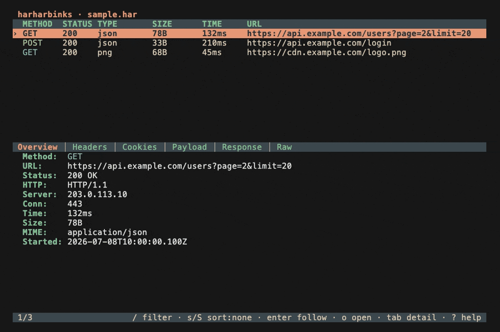

# harharbinks

[](https://github.com/bapatchirag/harharbinks/actions/workflows/ci.yml)
[](https://pkg.go.dev/github.com/bapatchirag/harharbinks)
[](LICENSE)

**harharbinks** is an offline HAR (HTTP Archive) and packet-capture viewer that
runs entirely in your terminal. Open a `.har` to browse its requests and
responses — headers, cookies, query strings, payloads, bodies, and a
reconstructed raw view — or open a `.pcap`/`.pcapng` for Wireshark-style,
packet-level inspection with a collapsible layer tree and a hex view. No browser,
no libpcap, and no network access by default.

<p align="center">
  
</p>

<p align="center"><em><a href="docs/screenshots.md">More screenshots &rarr;</a></em></p>

## Features

harharbinks bundles two inspectors into one static binary — an HTTP-archive
viewer and a packet-capture viewer — each with an interactive TUI and headless
commands, and each fully offline.

**HAR viewer**

- **Request list** — a scrollable table of every entry (method, status, type,
  URL, size, time) with a live summary pane and status bar.
- **Detail inspector** — grouped tabs (Overview, Headers, Cookies, Payload,
  Response, Raw) with base64 decoding, JSON pretty-printing, a binary-body
  summary, and a reconstructed on-the-wire HTTP request/response view.
- **Search & filter** — free-text search across any field, plus `field:value`
  scoped queries (e.g. `method:POST`, `status:2xx`, `host:example.com`); multiple
  terms are combined with AND.
- **Sort** — cycle sort presets forward and reverse (method, status, size, time,
  URL).
- **Follow session** — jump from any entry to every request/response that shares
  its connection (falling back to same host + time proximity).
- **Export** — copy an entry's URL, copy it as a cURL command, or save its
  response body to disk.

**PCAP viewer**

- **Packet list** — a scrollable, Wireshark-style table of every frame (number,
  time, source, destination, protocol, length, info), decoded purely in Go.
- **Packet detail** — a collapsible layer tree (Ethernet, IPv4/IPv6, ARP, TCP,
  UDP, ICMP, DNS, HTTP, TLS) paired with a hex/ASCII view; selecting a layer or
  field highlights the exact bytes it spans.
- **Conversations & statistics** — bidirectional 5-tuple flows with per-flow
  packet, byte, and duration totals, plus a capture summary, protocol hierarchy,
  and top talkers.
- **Follow conversation** — scope the packet list to one conversation's frames,
  the capture analogue of follow-session.
- **Search, filter & sort** — free-text and `field:value` filters (`proto`,
  `src`, `dst`, `port`, `info`) and sort presets (time, protocol, length, source,
  destination).
- **Reads `.pcap` and `.pcapng`** straight from disk — no libpcap and no live
  capture.

**Shared**

- **File browser** — pick a `.har`, `.pcap`, or `.pcapng` from within the app,
  with in-directory filtering; each file opens in the right viewer automatically.
- **Themes** — switch among built-in palettes (Kanagawa, Gruvbox, Everforest,
  Zenburn) with a live preview; your choice is persisted between runs.

**Headless CLI**

- **HAR** — `hhb ls`, `hhb show`, and `hhb curl`, with `--filter`, `--sort`,
  `--method`, `--status`, and `--json`.
- **PCAP** — `hhb pcap ls`, `show`, `flows`, and `stats`, with `--proto`,
  `--filter`, `--sort`, `--limit`, and `--json`.
- Every command reads from a file argument or from stdin, for scripting and quick
  lookups.

**Offline & portable**

- A single static binary (`CGO_ENABLED=0`), no browser, no libpcap, and no
  network access by default. The only feature that can reach the network is an
  **opt-in** update check (off unless you enable it); everything else — parsing,
  viewing, search, and export — is fully offline. See [Updates](#updates).

## Install

With the Go toolchain:

```sh
go install github.com/bapatchirag/harharbinks/cmd/hhb@latest
```

Or download a prebuilt binary for your platform from the
[Releases](https://github.com/bapatchirag/harharbinks/releases) page and put it on
your `PATH`.

Check the installed version:

```sh
hhb --version
```

## Usage

```text
hhb                       Open the interactive file browser to pick a file
hhb [file]                Open a HAR or PCAP file in the interactive viewer
hhb <command> [args]      Run a headless command

HAR commands:
  ls     [file]           List HAR entries
  show   <index> [file]   Show details for a single entry
  curl   <index> [file]   Print an entry as a cURL command

PCAP commands (run as `hhb pcap <command>`; see `hhb pcap` for flags):
  ls     [file]           List packets in the capture
  show   <index> [file]   Show one packet (layer stack + hex)
  flows  [file]           List conversations (5-tuple flows)
  stats  [file]           Summarize protocols and top talkers

Other commands:
  update [--check]        Check for a newer release, and optionally install it

Flags:
  --version               Print the harharbinks version and exit
  -h, --help              Show help
```

### Interactive viewer

Open a file directly, or launch with no argument to pick one in the file browser.
A `.har` opens in the HAR viewer and a `.pcap`/`.pcapng` in the PCAP viewer,
detected by extension and, when needed, by content:

```sh
hhb testdata/sample.har
hhb testdata/sample.pcap
hhb
```

Both viewers share the same navigation, search, sort, and app-level keys:

| Key | Action |
|-----|--------|
| `↑`/`↓` (`k`/`j`) | Move the selection |
| `ctrl+u`/`ctrl+d`, `g`/`G` | Page / jump |
| `/` | Search / filter (`field:value` or free text) |
| `s` / `S` | Cycle sort forward / reverse |
| `o` | Open the file browser |
| `c` | Settings |
| `?` | Help |
| `esc` | Back / clear the filter |
| `q` / `ctrl+c` | Quit |

In the **HAR viewer**:

| Key | Action |
|-----|--------|
| `←`/`→` (`h`/`l`) | Switch detail tabs |
| `tab` / `shift+tab` | Move focus between the list and the detail pane |
| `enter` | Follow the selected entry's session |
| `e` | Export menu (copy URL, copy as cURL, save body) |

In the **PCAP viewer**:

| Key | Action |
|-----|--------|
| `tab` / `shift+tab` | Cycle focus across the packet list, layer tree, and hex view |
| `←`/`→` | Collapse / expand the focused layer in the tree |
| `enter` | Follow the selected packet's conversation |
| `e` | Views menu (conversations, statistics) |

### Headless commands

Headless commands read from the `[file]` argument, or from stdin when it is
omitted. The HAR commands work on `.har` files:

```sh
hhb ls testdata/sample.har
hhb ls --method GET --sort size:desc testdata/sample.har
hhb ls --filter api --status 2xx --json testdata/sample.har
hhb show 3 testdata/sample.har
hhb curl 3 testdata/sample.har
cat capture.har | hhb ls
```

The `hhb pcap` commands work on `.pcap`/`.pcapng` captures:

```sh
hhb pcap ls testdata/sample.pcap
hhb pcap ls --proto TLS --sort len:desc testdata/sample.pcap
hhb pcap show 8 testdata/sample.pcap
hhb pcap flows testdata/sample.pcap
hhb pcap stats --json testdata/sample.pcap
cat capture.pcap | hhb pcap ls
```

## Configuration

Settings are stored at `~/.config/hhb/config.json` (the same path on macOS,
Linux, and Windows). The file is created on first run and holds your selected
theme (change it in the TUI with `c`) and the `update_check` opt-in flag
described under [Updates](#updates). Changes made in the TUI persist
automatically.

## Updates

harharbinks is **offline by default** and never contacts the network unless you
ask it to. Update behavior is entirely opt-in:

- **On demand.** `hhb update --check` reports whether a newer release exists, and
  `hhb update` downloads the latest release, verifies its checksum, and replaces
  the running binary in place after confirmation. Unless you enable the launch
  check below, these are the only commands that reach the network.
- **Launch check (opt-in).** Enable a once-a-day check by setting
  `"update_check": true` in `~/.config/hhb/config.json`, or the `HHB_UPDATE_CHECK`
  environment variable for a single run. When enabled, a release build shows a
  passive “update available” notice in the header — it never installs anything on
  its own.

The result is cached in `~/.config/hhb/update.json`, so the network is contacted
at most once per day. Development builds (anything not built from a release tag)
never check and are never self-updated; use
`go install github.com/bapatchirag/harharbinks/cmd/hhb@latest` or your package
manager instead.

## Roadmap

harharbinks ships as a HAR and PCAP inspector today. The next track builds on the
same offline, single-binary foundation:

- **Passive security auditor** — an offline findings engine
  over HAR and PCAP with a triage TUI and a headless `hhb audit` command
  (text/json/sarif/md/html reports and a `--fail-on` CI gate).

## Development

Requires [Go](https://go.dev/dl/) (latest stable).

```sh
make build          # compile ./bin/hhb
make test           # run tests with the race detector
make vet            # go vet
make fmt-check      # verify gofmt cleanliness
make lint           # golangci-lint (if installed)
make run            # build and run hhb
```

Releases are cut from SemVer tags (`vX.Y.Z`) via
[GoReleaser](https://goreleaser.com/) in GitHub Actions.

### Architecture

harharbinks is built in layers, and the TUI component library in
`internal/tui/component` is designed to be **completely reusable and modular**.
Every widget — `Table[T]`, `List[T]`, `Viewport`, `Search`, `Menu`, `StatusBar`,
`Modal`, `Toast`, and `FileBrowser` — is generic, self-contained, and entirely
domain-agnostic: it knows nothing about HAR, PCAP, or the application layer and
communicates only through injected themes/keymaps and decoupled messages. A
test-enforced guard keeps it that way — components never import `internal/har`,
`internal/pcap`, or `internal/app` — so the same library backs the HAR and PCAP
viewers today and the planned audit screens unchanged.

Every component is also demonstrated in isolation by the standalone gallery app:

```sh
make run-gallery    # or: go run ./cmd/gallery
```

## Contributing

Contributions are welcome — bug reports, feature ideas, and pull requests.

### Getting started

1. Fork and clone the repository.
2. Install [Go](https://go.dev/dl/) (latest stable).
3. Confirm a clean baseline:

   ```sh
   make build
   make test
   ```

### Workflow

Development is trunk-based:

1. Create a feature branch off `main` (e.g. `feat/short-description` or
   `fix/short-description`).
2. Make your change with matching tests.
3. Open a pull request against `main`. CI must pass before merge, and changes
   land as squash-merges.

### Before you open a PR

Run the same checks CI enforces and make sure they are green locally:

```sh
make build          # go build ./...
make test           # go test -race ./...
make vet            # go vet ./...
make fmt-check      # gofmt cleanliness (CI fails on any diff)
make lint           # golangci-lint (matches the pinned CI version)
```

CI runs on Linux and macOS (with a Windows build check) using the race detector
and coverage; the lint job pins golangci-lint (v2) to the version in
[`.github/workflows/ci.yml`](.github/workflows/ci.yml), and the lint rules live in
[`.golangci.yml`](.golangci.yml).

### Conventions

- **Layered architecture.** Inner layers never import outer ones. The component
  library in `internal/tui/component` is completely reusable and modular, so it
  must not import `internal/har`, `internal/pcap`, or `internal/app`, and the
  `har`/`pcap` domains never import each other. These boundaries are enforced by
  tests.
- **Tests travel with code.** Add or update unit, golden, and teatest coverage
  for behavior you change; regenerate golden files with the `-update` flag.
- **Document exported symbols** with full-sentence doc comments that explain
  intent.
- **Keep the build offline by default and static.** The binary must continue to
  build with `CGO_ENABLED=0`, and runtime network access must stay confined to
  the opt-in update path in `internal/update` (off by default) — no other package
  may reach the network.

### Reporting issues

Open an issue on the
[tracker](https://github.com/bapatchirag/harharbinks/issues) with steps to
reproduce and, where possible, a small sample `.har` that triggers the problem.

## License

[MIT](LICENSE) © 2026 Chirag Bapat
