# Screenshots

## Interactive viewer

### Request list & detail inspector

The main screen: a scrollable table of every entry on top, with a tabbed detail
inspector for the highlighted request below and a status bar of context-aware key
hints.

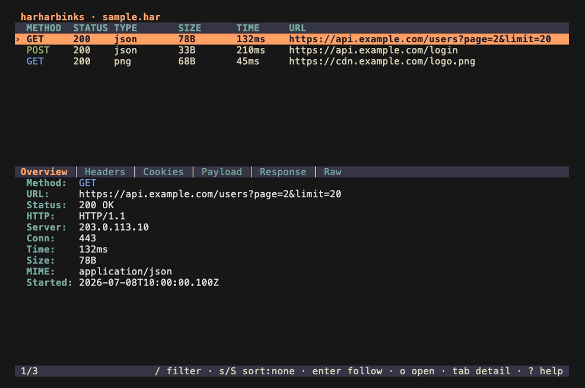

### Response body — pretty-printed JSON

The detail inspector groups a request into tabs (Overview, Headers, Cookies,
Payload, Response, Raw). JSON bodies are pretty-printed and syntax-highlighted;
base64 payloads are decoded and binary bodies are summarized.

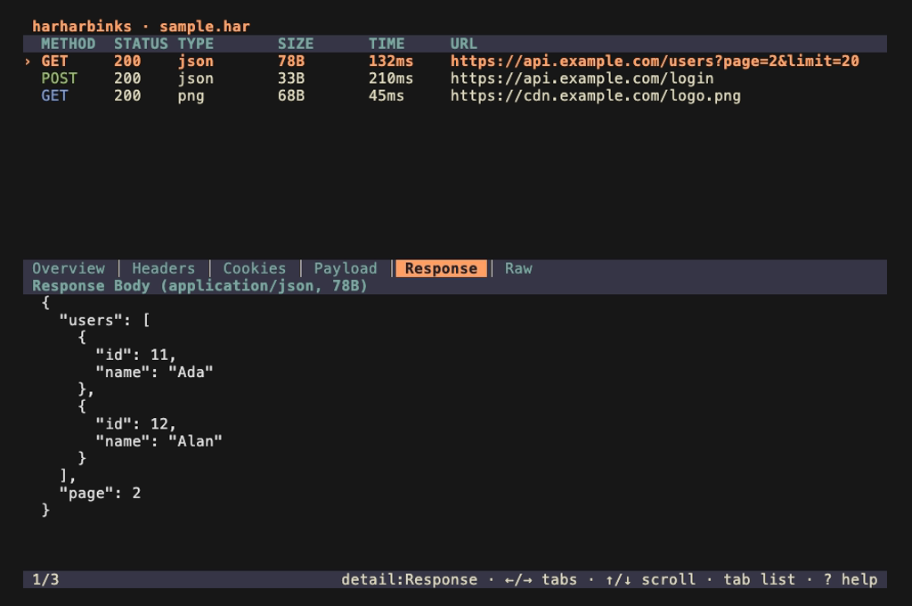

### Search & filter

Free-text search matches any field, and `field:value` terms (here `method:GET`)
scope the query; multiple terms are combined with AND. The list filters live as
you type.

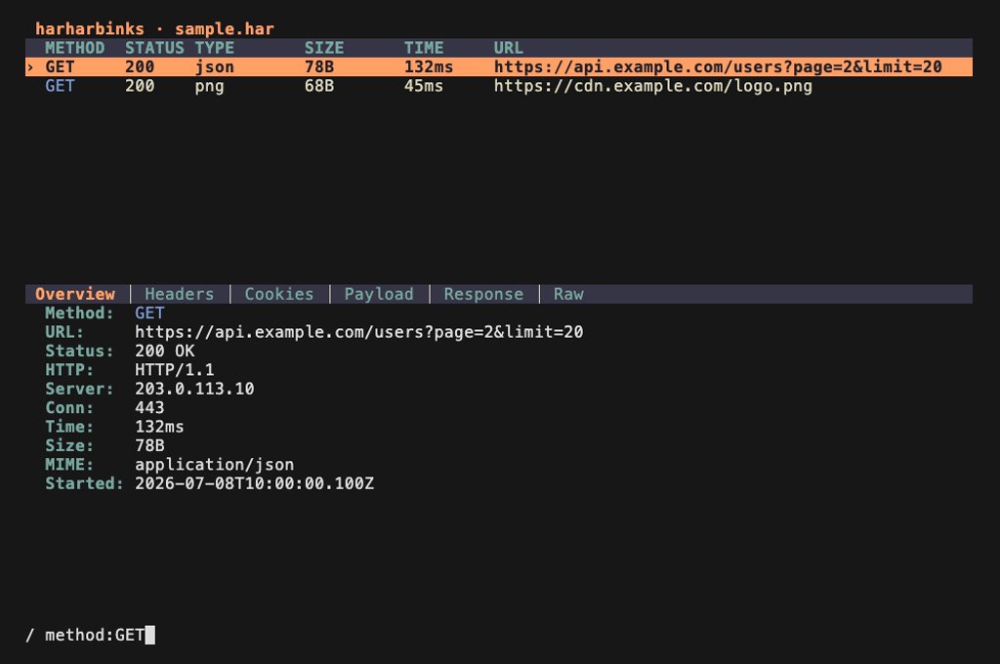

### Follow session

From any entry, jump to every request and response that shares its connection
(falling back to same host and time proximity), so a login flow or an API
sequence reads as one story.

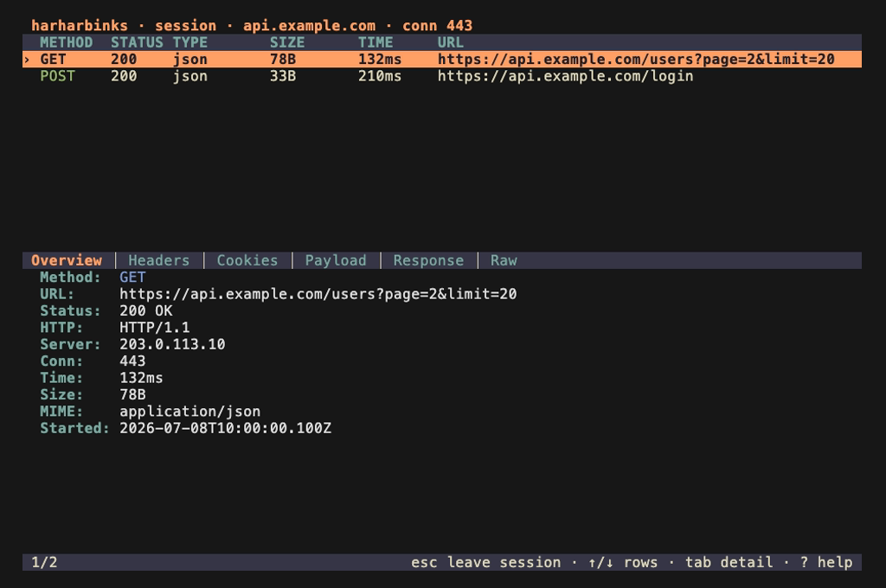

### File browser

Pick a `.har` capture from within the app, with in-directory filtering — no need
to pass a path on the command line.

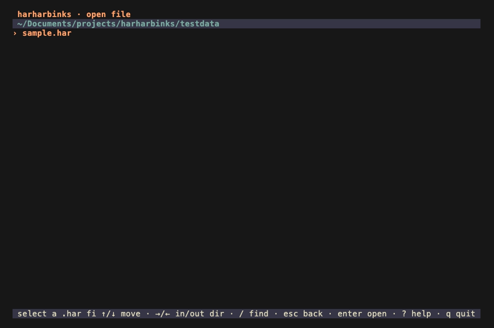

### Export menu

Copy an entry's URL, copy it as a ready-to-run cURL command, or save its response
body to disk.

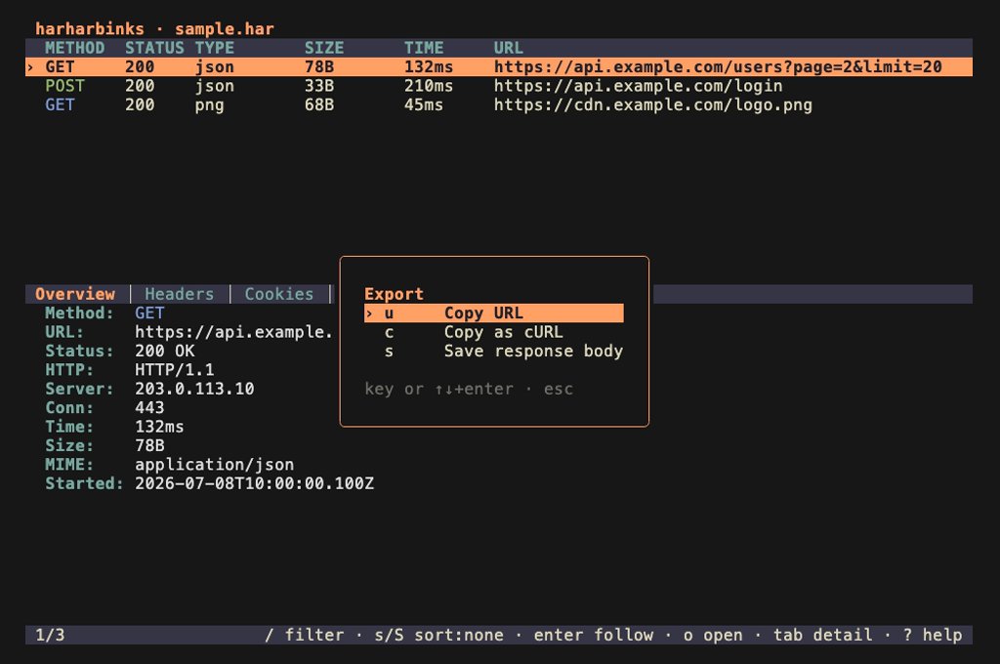

### Settings — theme selector

Switch among the built-in palettes (Kanagawa, Gruvbox, Everforest, Zenburn) with
a live preview; your choice is persisted between runs.

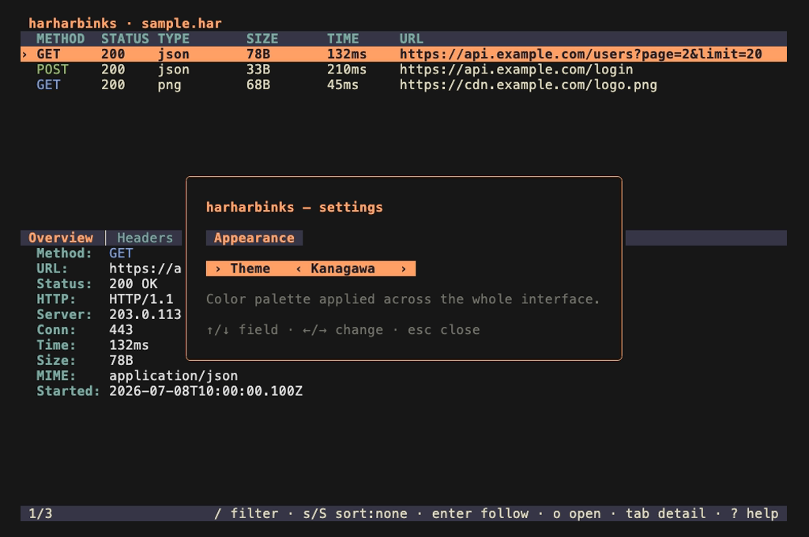

### Help

Every screen documents its own key bindings in a help overlay, toggled with `?`.

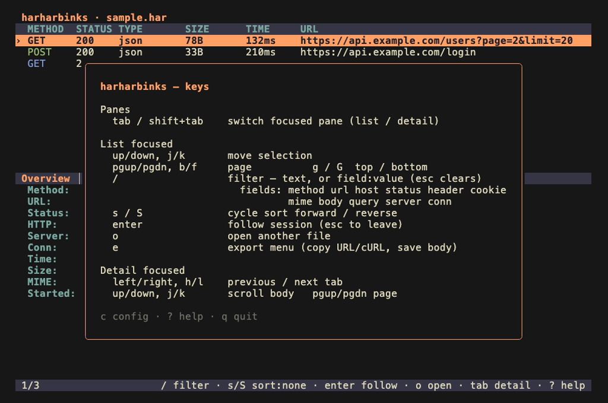

## Headless CLI

For scripting and quick lookups, `hhb` also runs without the TUI. Each command
reads from a file argument or from stdin.

### `hhb ls` — list entries

```sh
hhb ls testdata/sample.har
```

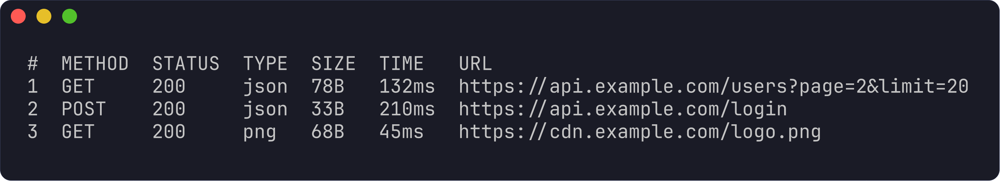

### `hhb show` — inspect one entry

```sh
hhb show 2 testdata/sample.har
```

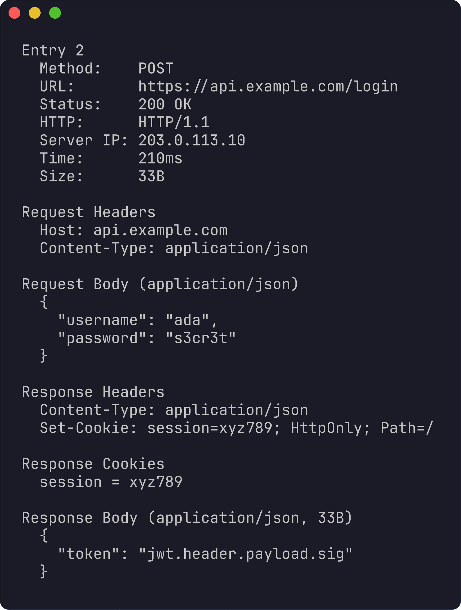

### `hhb curl` — reproduce as cURL

```sh
hhb curl 2 testdata/sample.har
```

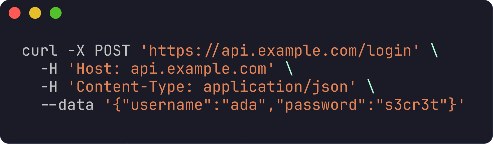
